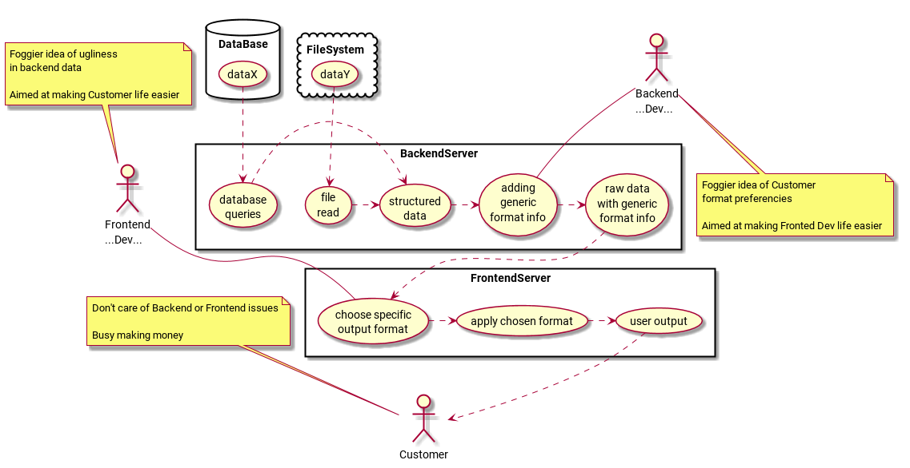

# decoupleUserOutput
Humble attempt to dissociate Backend generated data/schemas from friendly user Frontend formats

<!--

@startuml diagram.png

top to bottom direction
skinparam packageStyle rectangle

actor "Frontend\n...Dev..." as FD
actor "Backend\n...Dev..." as BD
actor Customer 

note bottom of BD: Foggier idea of Customer\nformat preferencies\n\nAimed at making Fronted Dev life easier
note top of FD: Foggier idea of ugliness\nin backend data\n\nAimed at making Customer life easier
note top of Customer: Don't care of Backend or Frontend issues\n\nBusy making their own life easier

rectangle BackendServer {
(file\nread) .> (structured\ndata)
(database\nqueries) .> (structured\ndata)
BD -- (adding\ngeneric\nformat info)
(structured\ndata) .> (adding\ngeneric\nformat info)
(adding\ngeneric\nformat info) .> (raw data\nwith generic\nformat info)
}

database DataBase {
(dataX) .> (database\nqueries)
}
cloud FileSystem {
(dataY) .> (file\nread)
}

rectangle FrontendServer {
(raw data\nwith generic\nformat info) .> (choose specific\noutput format)
(user output) .> Customer
(apply chosen format) .> (user output)
(choose specific\noutput format) .> (apply chosen format)
FD -- (choose specific\noutput format)
}

@enduml

-->
